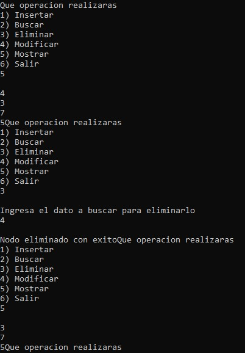

# Doubly Linked List CRUD

A console-based application that implements CRUD (Create, Read, Update, Delete) operations using a doubly linked list to manage integer values.

## Overview

This project demonstrates the implementation of a doubly linked list for storing and managing integer data through an interactive console application.

The application allows users to insert, search, modify, delete, and display integer values while maintaining bidirectional links between nodes.

It serves as an educational example of linked data structures, pointer manipulation, and dynamic memory allocation in C.

## Features

- Insert integer values.
- Search existing nodes.
- Modify stored values.
- Delete nodes.
- Display all elements.
- Doubly linked list implementation.
- Dynamic memory allocation.
- Interactive console menu.

## Screenshot



## Technologies

- C
- Standard C Library
- Dev-C++

## Project Structure

```text
.
├── assets
│   └── images
│       └── doubly_linked_list_crud_demo.jpg
├── doubly_linked_list_crud.cpp
├── README.md
├── LICENSE
└── .gitignore
```

## How to Compile

Using GCC:

```bash
g++ doubly_linked_list_crud.cpp -o doubly_linked_list_crud
```

## How to Run

Windows

```bash
doubly_linked_list_crud.exe
```

Linux/macOS

```bash
./doubly_linked_list_crud
```

## Concepts Demonstrated

- Doubly linked lists
- Dynamic memory allocation
- CRUD operations
- Pointer manipulation
- Dynamic data structures
- Menu-driven programming

## Future Improvements

- Validate duplicate values before insertion.
- Improve user input validation.
- Support sorting and filtering.
- Save and load data from files.
- Refactor into multiple source files.

## License

This project is licensed under the MIT License.

## Author

Luis Alva
